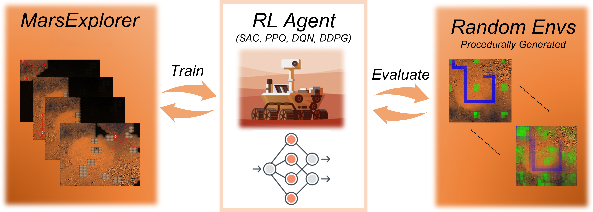

# MarsExplorer-Gymnasium



**MarsExplorer-Gymnasium** is a **Gymnasium-compatible** robotic exploration environment for autonomous terrain coverage in unknown, procedurally generated Mars-like landscapes.

It bridges modern Deep Reinforcement Learning methods with exploration and coverage planning under uncertainty.

For full details and evaluation results, see the companion paper:
[**MarsExplorer: Exploration of Unknown Terrains via Deep Reinforcement Learning and Procedurally Generated Environments**](https://www.mdpi.com/2079-9292/10/22/2751)

---

## 🚀 Achieved Results with PPO-based RL Agent


MarsExplorer-Gymnasium has been evaluated using PPO-based agents, demonstrating effective exploration behavior and strong coverage performance across diverse terrain configurations.

---

## 🌍 Strong Generalization Through Procedural Terrain Generation

Terrain diversification is a core attribute of MarsExplorer-Gymnasium.

Each episode is generated through an automated procedural pipeline with configurable variation levels, including:

* Number, size, and placement of obstacles
* Terrain scalability (map size)
* Required exploration coverage threshold
* Bonus rewards for successful completion

This diversity enforces robust generalization — a critical property for real-world robotic deployment where unseen terrain configurations are inevitable.


---

# Installation

## Quick Start

### Install via pip

```bash
pip install git+https://github.com/markub3327/MarsExplorer@main
```

---

## Usage Example (Gymnasium API)

```python
import gymnasium as gym
import mars_explorer

env = gym.make("explorer-v1")

obs, info = env.reset()

done = False
while not done:
    action = env.action_space.sample()
    obs, reward, terminated, truncated, info = env.step(action)
    done = terminated or truncated

env.close()
```

MarsExplorer-Gymnasium follows the standard **Gymnasium API**, making it directly compatible with modern reinforcement learning libraries.

---

# Citation

If you use MarsExplorer-Gymnasium in your research, please cite:

```bibtex
@article{Koutras2021MarsExplorer,
  title={MarsExplorer: Exploration of Unknown Terrains via Deep Reinforcement Learning and Procedurally Generated Environments},
  author={Dimitrios I. Koutras and A. C. Kapoutsis and A. Amanatiadis and E. B. Kosmatopoulos},
  journal={Electronics},
  volume={10},
  number={22},
  pages={2751},
  year={2021},
  doi={10.3390/electronics10222751},
  url={https://www.mdpi.com/2079-9292/10/22/2751}
}
```
